# Univariate-Analysis 
## Airbnb

### UNIVARIATE ANALYSIS

First, we import the necessary libraries for data analysis and visualization. Then, we display the first few rows of the dataset to understand its structure.

```python
import pandas as pd
import numpy as np
import seaborn as sns
import matplotlib.pyplot as plt
from scipy import stats

airbnb.head()
```
```text
   listing_id  price    rating listing_added  \
0        3831   89.0  3.273935    2018-12-30   
1        6848  140.0  3.495760    2018-12-24   
2        7322  140.0  4.389051    2018-12-26   
3        7726   99.0  3.305382    2018-12-17   
4       12303  120.0  4.568745    2018-03-27   

                                              name  host_id         host_name  \
0                  Cozy Entire Floor of Brownstone     4869       LisaRoxanne   
1                 Only 2 stops to Manhattan studio    15991     Allen & Irina   
2                                  Chelsea Perfect    18946              Doti   
3  Hip Historic Brownstone Apartment with Backyard    20950  Adam And Charity   
4                1bdr w private bath. in lofty apt    47618           Yolande   

      room_type  number_of_reviews last_review  reviews_per_month  \
0  Entire place                270  2019-07-05               4.64   
1  Entire place                148  2019-06-29               1.20   
2  Private Room                260  2019-07-01               2.12   
3  Entire place                 53  2019-06-22               4.44   
4  Private Room                 25  2018-09-30               0.23   

   availability_365  number_of_stays   5_stars  latitude  longitude  \
0               194            324.0  0.757366  40.68514  -73.95976   
1                46            177.6  0.789743  40.70837  -73.95352   
2                12            312.0  0.669873  40.74192  -73.99501   
3                21             63.6  0.640251  40.67592  -73.94694   
4               311             30.0  0.918593  40.69673  -73.97584   

  neighbourhood        borough  is_rated  logprice  
0      brooklyn   clinton hill         1  4.488636  
1      brooklyn   williamsburg         1  4.941642  
2     manhattan        chelsea         1  4.941642  
3      brooklyn  crown heights         1  4.595120  
4      brooklyn    fort greene         1  4.787492  
```

We calculate descriptive statistics for the numerical columns. This gives us a quick overview of the central tendency, dispersion, and shape of the dataset's distribution.

```python
# descriptive statistics for selected numerical columns
airbnb[['price', 'logprice', 'rating', 'number_of_reviews', 'reviews_per_month', 'number_of_stays', '5_stars']].describe()
```
```text
             price     logprice       rating  number_of_reviews  \
count  9993.000000  9993.000000  7922.000000        9993.000000   
mean    150.712090         -inf     4.013874          22.473331   
std     202.292741          NaN     0.574847          43.201238   
min       0.000000         -inf     3.000633           0.000000   
25%      70.000000     4.248495     3.519701           1.000000   
50%     110.000000     4.700480     4.027965           5.000000   
75%     175.000000     5.164786     4.514762          22.000000   
max    8000.000000     8.987197     5.000000         510.000000   

       reviews_per_month  number_of_stays      5_stars  
count        9993.000000      9993.000000  9993.000000  
mean            1.073992        26.967998     0.569689  
std             1.540710        51.841486     0.299871  
min             0.000000         0.000000     0.000000  
25%             0.040000         1.200000     0.611666  
50%             0.370000         6.000000     0.681906  
75%             1.550000        26.400000     0.750112  
max            16.220000       612.000000     0.950339  
```

Next, we generate a detailed summary statistics table specifically for the `price` column. This includes measures like variance, interquartile range (IQR), skewness, and kurtosis to deeply analyze the pricing distribution.

```python
# summary statistics for price
price_summary = pd.DataFrame({
    'Statistic': [
        'Mean',
        'Median',
        'Mode',
        'Minimum',
        'Maximum',
        'Range',
        'Variance',
        'Standard deviation',
        'IQR',
        'Skewness',
        'Kurtosis'
    ],
    'Value': [
        airbnb['price'].mean(),
        airbnb['price'].median(),
        airbnb['price'].mode().iloc[0],
        airbnb['price'].min(),
        airbnb['price'].max(),
        airbnb['price'].max() - airbnb['price'].min(),
        airbnb['price'].var(),
        airbnb['price'].std(),
        stats.iqr(airbnb['price']),
        stats.skew(airbnb['price']),
        stats.kurtosis(airbnb['price'])
    ]
})

price_summary
```
```text
             Statistic         Value
0                 Mean    150.712090
1               Median    110.000000
2                 Mode    150.000000
3              Minimum      0.000000
4              Maximum   8000.000000
5                Range   8000.000000
6             Variance  40922.353238
7   Standard deviation    202.292741
8                  IQR    105.000000
9             Skewness     14.742521
10            Kurtosis    381.800146
```

We create a histogram to visualize the distribution of Airbnb prices, filtering out the top 5% extreme outliers. This helps us see where the majority of listing prices are concentrated.

```python
# visualizing the distribution of price
plt.figure(figsize=(8, 5))

sns.histplot(data=airbnb[airbnb['price'] < airbnb['price'].quantile(0.95)], x='price', bins=30, kde=True)

plt.title('Distribution of Airbnb Prices up to 95th Percentile')
plt.xlabel('Price per Night')
plt.ylabel('Number of Listings')
plt.show()
```
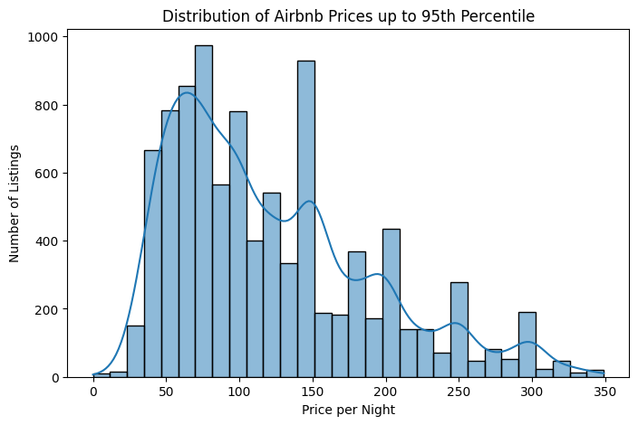

A boxplot is generated for the `price` column to further inspect its spread and identify potential outliers visually.

```python
# boxplot of price
plt.figure(figsize=(8, 5))

sns.boxplot(x=airbnb[airbnb['price'] < airbnb['price'].quantile(0.95)]['price'])

plt.title('Boxplot of Airbnb Prices up to 95th Percentile')
plt.xlabel('Price per Night')
plt.show()
```
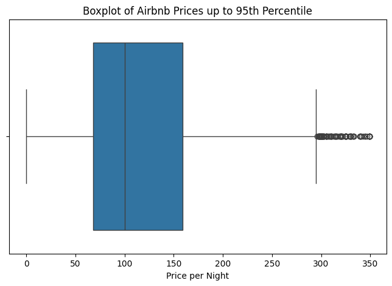
*The distribution of `price` is right-skewed.  
Most listings have relatively low or moderate prices, while a smaller number of listings are much more expensive.

Because of this, the median is a better measure of a typical Airbnb price than the mean.*

Similar to the price analysis, we compute comprehensive summary statistics for the `rating` column. This helps us understand how guests generally rate their stays.

```python
# summary statistics for rating
rating_summary = pd.DataFrame({
    'Statistic': [
        'Mean',
        'Median',
        'Mode',
        'Minimum',
        'Maximum',
        'Range',
        'Variance',
        'Standard deviation',
        'IQR',
        'Skewness',
        'Kurtosis'
    ],
    'Value': [
        airbnb['rating'].mean(),
        airbnb['rating'].median(),
        airbnb['rating'].mode().iloc[0],
        airbnb['rating'].min(),
        airbnb['rating'].max(),
        airbnb['rating'].max() - airbnb['rating'].min(),
        airbnb['rating'].var(),
        airbnb['rating'].std(),
        stats.iqr(airbnb['rating'].dropna()),
        stats.skew(airbnb['rating'].dropna()),
        stats.kurtosis(airbnb['rating'].dropna())
    ]
})

rating_summary
```
```text
             Statistic     Value
0                 Mean  4.013874
1               Median  4.027965
2                 Mode  5.000000
3              Minimum  3.000633
4              Maximum  5.000000
5                Range  1.999367
6             Variance  0.330450
7   Standard deviation  0.574847
8                  IQR  0.995061
9             Skewness -0.041153
10            Kurtosis -1.193729
```

We visualize the distribution of ratings using a histogram with a kernel density estimate (KDE). This shows the frequency of different rating scores across all listings.

```python
# visualizing the distribution of rating
plt.figure(figsize=(8, 5))

sns.histplot(data=airbnb, x='rating', bins=20,kde=True)

plt.title('Distribution of Airbnb Ratings')
plt.xlabel('Rating')
plt.ylabel('Number of Listings')
plt.show()
```
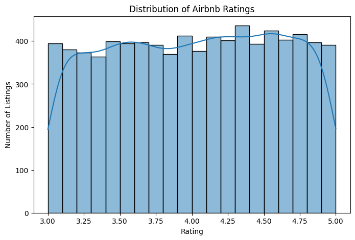
*The `rating` distribution shows how listings are evaluated by guests.  
Since ratings are capped at 5, many listings may be concentrated close to the maximum value.*

Detailed summary statistics are calculated for the `number_of_reviews` column. This provides insights into the level of engagement and activity for the listings.

```python
# summary statistics for number_of_reviews
reviews_summary = pd.DataFrame({
    'Statistic': [
        'Mean',
        'Median',
        'Mode',
        'Minimum',
        'Maximum',
        'Range',
        'Variance',
        'Standard deviation',
        'IQR',
        'Skewness',
        'Kurtosis'
    ],
    'Value': [
        airbnb['number_of_reviews'].mean(),
        airbnb['number_of_reviews'].median(),
        airbnb['number_of_reviews'].mode().iloc[0],
        airbnb['number_of_reviews'].min(),
        airbnb['number_of_reviews'].max(),
        airbnb['number_of_reviews'].max() - airbnb['number_of_reviews'].min(),
        airbnb['number_of_reviews'].var(),
        airbnb['number_of_reviews'].std(),
        stats.iqr(airbnb['number_of_reviews']),
        stats.skew(airbnb['number_of_reviews']),
        stats.kurtosis(airbnb['number_of_reviews'])
    ]
})

reviews_summary
```
```text
             Statistic        Value
0                 Mean    22.473331
1               Median     5.000000
2                 Mode     0.000000
3              Minimum     0.000000
4              Maximum   510.000000
5                Range   510.000000
6             Variance  1866.346992
7   Standard deviation    43.201238
8                  IQR    21.000000
9             Skewness     3.626048
10            Kurtosis    17.837771
```

A histogram is plotted to visualize how the number of reviews is distributed among the listings, excluding the top 5% most reviewed properties to focus on the general trend.

```python
# visualizong the distribution of number_of_reviews
plt.figure(figsize=(8, 5))

sns.histplot(data=airbnb[airbnb['number_of_reviews'] < airbnb['number_of_reviews'].quantile(0.95)], x='number_of_reviews', bins=30,kde=True)

plt.title('Distribution of Number of Reviews up to 95th Percentile')
plt.xlabel('Number of Reviews')
plt.ylabel('Number of Listings')
plt.show()
```
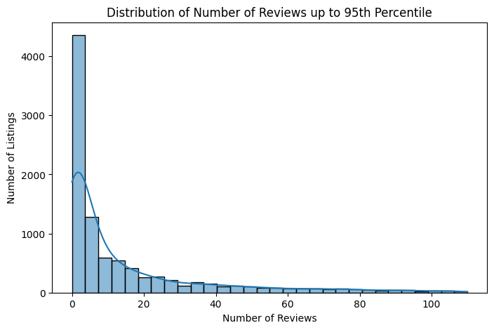
*The `number_of_reviews` variable is right-skewed.  
Most listings have only a small number of reviews, while a smaller group of listings has many reviews.

This suggests that only some listings are very active or popular among guests.*
### Categorical variables

Moving on to categorical variables, we count the frequencies of each `room_type`. This tells us the absolute number of listings available for each room category.

```python
# frequency table for room_type
airbnb['room_type'].value_counts()
```
```text
room_type
Entire place    5172
Private Room    4595
Shared room      226
Name: count, dtype: int64
```

We calculate the percentage distribution of the `room_type` column. This gives us the relative market share of entire places, private rooms, and shared rooms.

```python
# percentage distribution of room_type
airbnb['room_type'].value_counts(normalize=True) * 100
```
```text
room_type
Entire place    51.756229
Private Room    45.982188
Shared room      2.261583
Name: proportion, dtype: float64
```

A count plot is created to visually compare the different room types. The bars are ordered by frequency to easily identify the most and least common offerings.

```python
# visualizing room_type distribution
plt.figure(figsize=(8, 5))

sns.countplot(data=airbnb, x='room_type',order=airbnb['room_type'].value_counts().index)

plt.title('Number of Listings by Room Type')
plt.xlabel('Room Type')
plt.ylabel('Number of Listings')
plt.xticks(rotation=30)
plt.show()
```
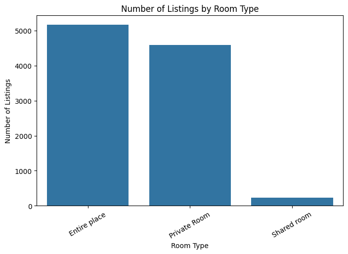
*The `room_type` distribution shows which types of Airbnb listings are most common.  
The most frequent categories represent the main structure of the Airbnb market in this dataset.*

We identify the top 10 most frequent specific locations (neighborhoods) in the dataset. This highlights the most popular areas for Airbnb listings.

```python
# top 10 locations in the borough column
airbnb['borough'].value_counts().head(10)
```
```text
borough
bedford-stuyvesant    774
williamsburg          764
harlem                540
bushwick              501
hell's kitchen        405
upper west side       394
upper east side       372
east village          366
crown heights         325
midtown               321
Name: count, dtype: int64
```

A horizontal bar chart is generated to visualize the top 10 locations. This makes it easy to compare the number of listings across the most popular areas.

```python
# visualizing top 10 locations
top_borough = airbnb['borough'].value_counts().head(10)

plt.figure(figsize=(8, 5))

sns.barplot(x=top_borough.values, y=top_borough.index)

plt.title('Top 10 Locations by Number of Listings')
plt.xlabel('Number of Listings')
plt.ylabel('Location')
plt.show()
```
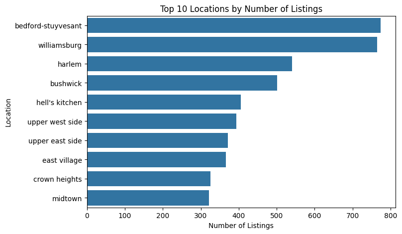
*The chart shows that Airbnb listings are concentrated in several popular locations.  
The most frequent locations include Bedford-Stuyvesant, Williamsburg, Harlem, Bushwick, and Hell's Kitchen.

This means that listings are not evenly distributed across all locations. Some areas have much stronger Airbnb activity than others.*

We also check the distribution of listings across the broader `neighbourhood` (borough) groups. This shows which main districts dominate the Airbnb market.

```python
airbnb['neighbourhood'].value_counts().head(10)
```
```text
neighbourhood
manhattan        4436
brooklyn         4075
queens           1180
bronx             229
staten island      73
Name: count, dtype: int64
```

We visualize the listing counts for these broader neighbourhood groups using a bar chart, providing a clear picture of the geographic distribution.

```python
# visualizing top 10 neighbourhoods
top_neighbourhoods = airbnb['neighbourhood'].value_counts().head(10)

plt.figure(figsize=(8, 5))

sns.barplot(x=top_neighbourhoods.values, y=top_neighbourhoods.index)

plt.title('Top 10 Neighbourhoods by Number of Listings')
plt.xlabel('Number of Listings')
plt.ylabel('Neighbourhood')
plt.show()
```
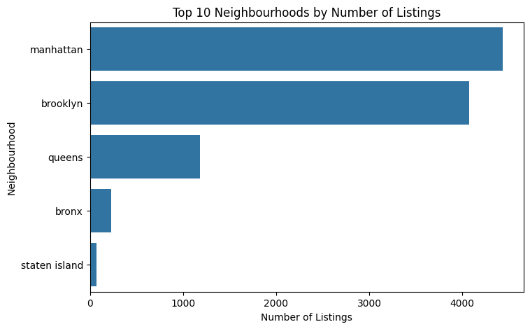
*The top neighbourhoods contain the highest number of Airbnb listings.  
This concentration may be connected with central location, tourism, transport access, or popularity among visitors.*

We create a frequency table for the `is_rated` column to see how many listings have received a rating versus those that haven't.

```python
# frequency table for is_rated
airbnb['is_rated'].value_counts()
```
```text
is_rated
1    7922
0    2071
Name: count, dtype: int64
```

We then calculate the percentage of rated versus unrated listings. This helps us understand the proportion of properties with active guest feedback.

```python
# percentage distribution of is_rated
airbnb['is_rated'].value_counts(normalize=True) * 100
```
```text
is_rated
1    79.275493
0    20.724507
Name: proportion, dtype: float64
```

Finally, a count plot is used to visually compare the number of rated and unrated listings, emphasizing the ratio of reviewed properties.

```python
# visualizing rated and unrated listings
plt.figure(figsize=(6, 4))

sns.countplot(data=airbnb, x='is_rated')

plt.title('Number of Rated and Unrated Listings')
plt.xlabel('Is Rated')
plt.ylabel('Number of Listings')
plt.show()
```
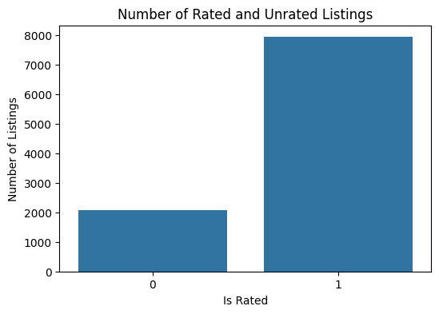
*The `is_rated` variable shows whether a listing has received a rating.  
Listings without ratings may be new, inactive, or not frequently booked.*
*## Conclusions

The univariate analysis helped us understand the main characteristics of the cleaned Airbnb dataset.

Main findings:

- The `price` variable is right-skewed, which means that most listings are cheaper, while a smaller number of expensive listings increase the average price.
- The median is a better measure of typical Airbnb price than the mean because the mean is affected by outliers.
- Ratings are limited to the range from 0 to 5 and are often concentrated near higher values.
- The `number_of_reviews` variable is right-skewed because many listings have few reviews, while only some listings have many reviews.
- The categorical variables show which room types, boroughs, and neighbourhoods are most common in the dataset.*

## Exercise 8 solution (pokemon)
### How to calculate the mean life expectancy for EUROPEan countries (2007).

```python
#1
df_gapminder[(df_gapminder['continent'] == 'Europe') & (df_gapminder['year'] == 2007)]['life_exp'].mean()
```
```text
np.float64(77.6486)
```

### Is it possible to calculate the average of the column “continent”? Why or why not?

*No, it is not possible because 'continent' is a categorical nominal variable.*

*Average (mean) can be calculated for numerical variables only.*

### - Subtract each observation in `numbers` from the `average` of this `list`. - Then calculate the sum of these deviations from the `average`. What is their sum?

```python
numbers = np.array([1, 2, 3, 4])
#3
average = np.mean(numbers)
deviations = average - numbers
sum_of_deviations = np.sum(deviations)
print('Average:', average)
print('Deviations:', deviations)
print('Sum of deviations:', sum_of_deviations)
```
```text
Average: 2.5
Deviations: [ 1.5  0.5 -0.5 -1.5]
Sum of deviations: 0.0
```

### Is it possible to calculate the median of the column “continent”? Why or why not?

*No, it is not possible because 'continent' is a categorical nominal variable.*

*Median can be calculated for ordered data, but continents rather do not have any common order.*

### Try to change the boxplot into the violin plot (or add it). Looking at the aforementioned quantile results and the box plot, try to interpret these measures.

```python
#5
fig, ax = plt.subplots(figsize=(8, 6))
sns.violinplot(data=mydata, ax=ax)

minimum = np.min(mydata)
q1 = np.percentile(mydata, 25)
median = np.median(mydata)
q3 = np.percentile(mydata, 75)
maximum = np.max(mydata)
mean = np.mean(mydata)

ax.scatter(0, minimum, color='red', label='Min', zorder=5)
ax.scatter(0, q1, color='orange', label='Q1', zorder=5)
ax.scatter(0, median, color='lightgreen', label='Median', zorder=5)
ax.scatter(0, q3, color='purple', label='Q3', zorder=5)
ax.scatter(0, maximum, color='yellow', label='Max', zorder=5)
ax.scatter(0, mean, color='pink', marker='D', s=60, label='Mean', zorder=5)

for value, name, color in zip(
    [minimum, q1, median, mean, q3, maximum],
    ['Min', 'Q1', 'Median', 'Mean', 'Q3', 'Max'],
    ['red', 'orange', 'lightgreen', 'pink', 'purple', 'yellow']
):
    ax.text(0.1, value, f'{name}: {value:.2f}', verticalalignment='center', color=color)

ax.set_title("Violin plot of mydata")
ax.legend()

plt.show()

print("Minimum:", minimum)
print("Q1:", q1)
print("Median:", median)
print("Q3:", q3)
print("Maximum:", maximum)
print("Mean:", mean)
print("IQR:", q3 - q1)

# Interpretation:
# The median is 12, which means that half of the values are below or equal to 12
# and half of the values are above or equal to 12.
# Q1 is 7, so about 25% of the values are below or equal to 7.
# Q3 is 14, so about 75% of the values are below or equal to 14.
# The interquartile range is Q3 - Q1 = 7, so the middle 50% of values
# are between 7 and 14.
# The boxplot does not show any clear outliers.
# The violin plot shows the shape of the distribution and where values
# are more concentrated.
```
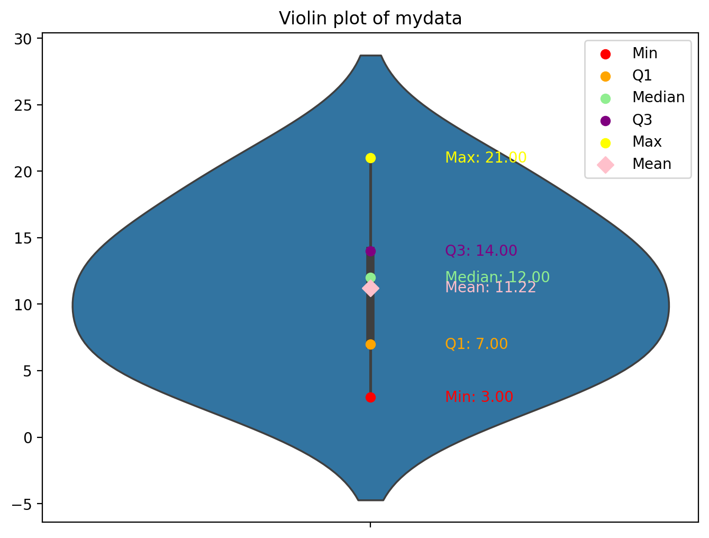
```text
Minimum: 3
Q1: 7.0
Median: 12.0
Q3: 14.0
Maximum: 21
Mean: 11.222222222222221
IQR: 7.0
```

### Calculate STD and CV for the SPEED of LEGENDARY and NOT LEGENDARY pokemons. What is the IQR deviation?

```python
#6
for leg, group in df_pokemon.groupby('Legendary')['Speed']:
    std = group.std()
    cv = (std / group.mean()) * 100
    iqr_dev = (group.quantile(0.75) - group.quantile(0.25)) / 2
    print(f"Legendary: {leg} | STD: {std}, CV: {cv}%, IQR Dev: {iqr_dev}")
```
```text
Legendary: False | STD: 27.843037886581946, CV: 42.53717074753218%, IQR Dev: 20.0
Legendary: True | STD: 22.952323076660118, CV: 22.91002764101517%, IQR Dev: 10.0
```

### Try to interpret the above-mentioned result and calculate example slant ratios for several groups of Pokémon.

```python
#7
skewness = df_pokemon.groupby('Legendary')['Speed'].skew()
print(skewness)

#Interpretation: 
#Values > 0 mean the distribution is right-skewed
#Values < 0 mean the distribution is left-skewed
#Values near 0 mean it is symmetric
```
```text
Legendary
False    0.390119
True     0.442403
Name: Speed, dtype: float64
```

### Try to calculate the IQR Skewness coefficient for the sample data:

```python
mydata = [3, 7, 8, 5, 12, 14, 21, 13, 18]
#8
q1, median, q3 = np.percentile(mydata, [25, 50, 75])

iqr_skewness = ((q3 - median) - (median - q1)) / (q3 - q1)
print(iqr_skewness)
```
```text
-0.42857142857142855
```

### Try to calculate the IQR Kurtosis coefficient for the sample data:

```python
mydata = [3, 7, 8, 5, 12, 14, 21, 13, 18]
#9
q1 = np.percentile(mydata, 25)
q3 = np.percentile(mydata, 75)
c10 = np.percentile(mydata, 10)
c90 = np.percentile(mydata, 90)

iqr_kurtosis = (q3 - q1) / (2 * (c90 - c10))
print(iqr_kurtosis)
```
```text
0.24999999999999997
```

### Add some cross-sectional plots and try to interpret the results.

```python
#10
sns.boxplot(data=df_pokemon, x='Legendary', y='Attack', hue='Legendary')
plt.title('Boxplot: Attack by Legendary Status')
plt.show()

sns.violinplot(data=df_pokemon, x='Legendary', y='Attack', hue='Legendary')
plt.title('Violin Plot: Attack by Legendary Status')
plt.show()

#Legendary pokemon have a significantly higher median attack
#The non-legendary group has several high-value outliers stretching up to 185
#Legendary group shows no outliers meaning their high attack values are standard for their group distribution
#Violin plot reveals that non-legendary attack stats are heavily concentrated in the lower range (50-70) and right-skewed 
#Legendary attack stats have a wider flatter distribution centered much higher (100-130)
```
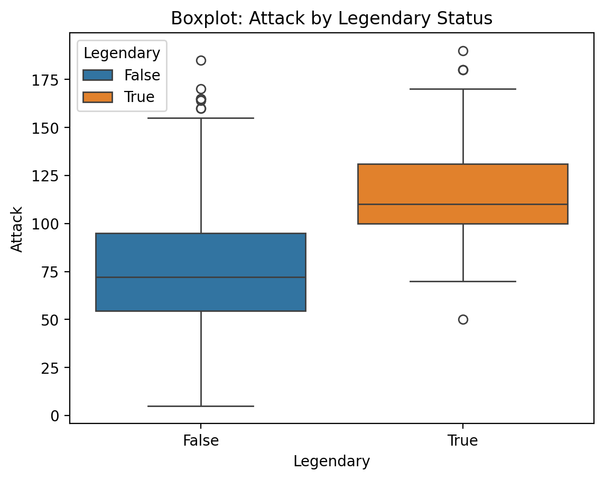
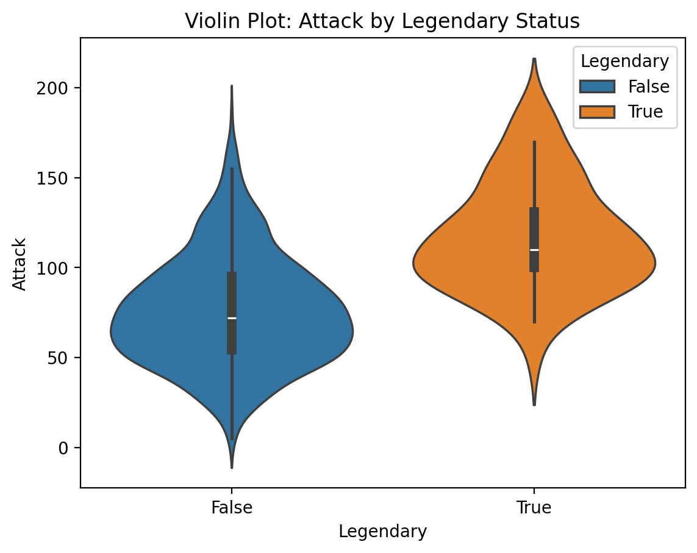